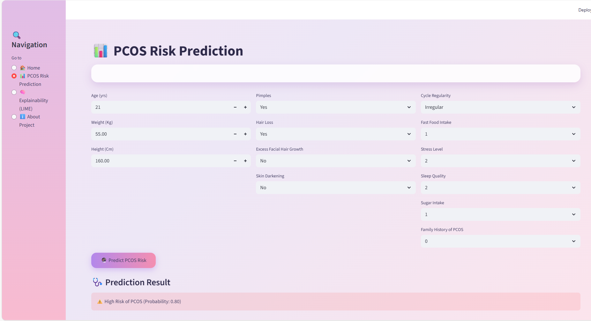
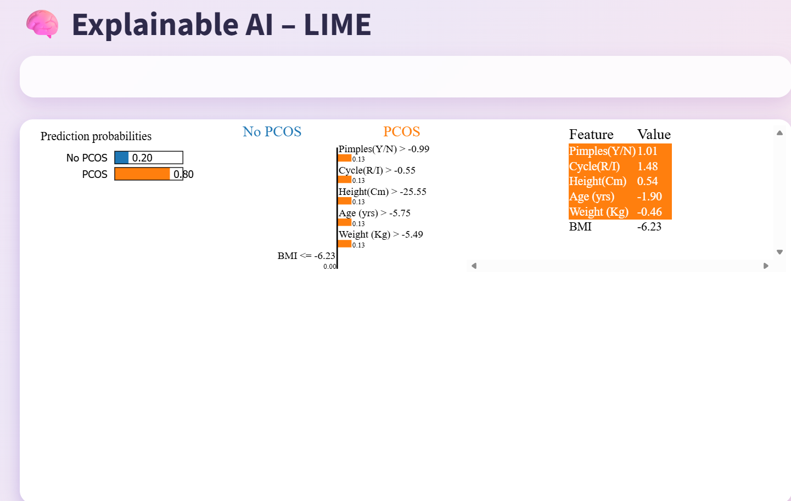

# PCOS AI Clinical Decision Support System (CDSS)

## 🩺 Overview

This project implements an AI-powered Clinical Decision Support System for early detection and risk assessment of Polycystic Ovary Syndrome (PCOS). The system uses machine learning models to analyze clinical and lifestyle factors, providing explainable predictions to assist healthcare professionals in diagnosis and treatment planning. The methodology incorporates Federated Learning techniques to ensure privacy-preserving model training across distributed data sources.

## 🎯 Features

- **Risk Prediction**: Real-time PCOS risk assessment based on clinical parameters
- **Explainable AI**: LIME-based explanations for model predictions
- **Interactive Web Interface**: User-friendly Streamlit application
- **Privacy-Aware Federated Learning**: FedAvg implementation for distributed, privacy-preserving model training
- **Comprehensive Analysis**: Considers multiple physiological and lifestyle factors

## 📊 Datasets

- **Training Dataset**: `PCOS_data_without_infertility.csv` - Clinical data for model training
- **Testing Dataset**: `Real_Time_Testing.csv` - Lifestyle survey data for validation

## 🤖 Model

- **Algorithm**: K-Nearest Neighbors (KNN)
- **Features**: Standardized clinical parameters
- **Performance**: Optimized for accuracy and interpretability

## 🛠️ Technologies Used

- **Frontend**: Streamlit
- **Backend**: Python
- **ML Libraries**: scikit-learn, joblib, LIME, XGBoost
- **Federated Learning**: Flower (FedAvg implementation)
- **Data Processing**: pandas, numpy
- **Visualization**: matplotlib, seaborn

## 📋 Prerequisites

- Python 3.8+
- Virtual environment (recommended)

## 🚀 Installation

1. **Clone the repository** (if applicable) or navigate to the project directory.

2. **Create and activate virtual environment**:
   ```bash
   python -m venv pcos_env
   pcos_env\Scripts\activate  # On Windows
   ```

3. **Install dependencies**:
   ```bash
   pip install -r requirements.txt
   ```

## ▶️ Usage

1. **Run the application**:
   ```bash
   streamlit run app.py
   ```

2. **Access the web interface** at `http://localhost:8501`

3. **Navigate through pages**:
   - **Home**: Overview of PCOS and project objectives
   - **PCOS Risk Prediction**: Input patient data and get predictions with explanations

### Screenshots

#### Home Page

*Overview of PCOS information and project objectives*

#### Prediction Page

*Interactive form for PCOS risk assessment with input fields*

#### Explainability Results

*LIME-based explanation showing feature contributions to the prediction*

## 📁 Project Structure

```
├── app.py                 # Main Streamlit application
├── model_loader.py        # Model loading utilities
├── preprocessing.py       # Data preprocessing functions
├── prediction.py          # Prediction logic
├── explainability.py      # LIME explanation generation
├── Methodology.ipynb      # Detailed methodology and model development
├── requirements.txt       # Python dependencies
├── artifacts/             # Trained model and scaler files
├── PCOS_data_without_infertility.csv  # Training dataset
├── Real_Time_Testing.csv  # Testing dataset
└── pcos_env/              # Virtual environment
```

## 📈 Methodology

The system follows a comprehensive approach:

1. **Data Collection**: Integration of clinical and lifestyle datasets
2. **Preprocessing**: Feature engineering and standardization
3. **Model Training**: Comparison of multiple ML algorithms (Logistic Regression, Random Forest, XGBoost, KNN)
4. **Federated Learning**: Implementation of FedAvg for privacy-preserving distributed training
5. **Model Selection**: KNN selected for optimal performance
6. **Explainability**: LIME implementation for prediction transparency
7. **Deployment**: Streamlit web application

## 🤝 Contributing

This is a final implementation project. For modifications or extensions, please ensure:

- Maintain code quality and documentation
- Test changes thoroughly
- Update dependencies if needed

## 📄 License

This project is for educational and research purposes.

## 👥 Authors

Developed as part of 7th Semester Final Implementation by:
 - Sarojini Vaishnavi Peri
 - G Santosh Kumar
 - C Akshatha Shivani
 - Kruthika

Focus: PCOS Risk Analysis and Early Detection using AI

## 📞 Support

For questions or issues, please refer to the Methodology.ipynb notebook for detailed technical documentation.